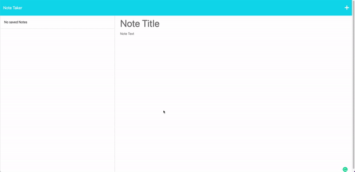

# Note Taker App - Challenge 11

## Description

This app allows you to enter personal notes that are then added to the left side panel. You are also able to delete notes that you have stored. 



## Table of Contents

* [Installation](#installation)
* [Usage](#usage)
* [Screenshot](#screenshot)
* [Questions](#questions)

## Installation

Run ```npm install``` to install  necessary modules in node.

## Usage

Enter a note in the text edit field, and then hit the  'Save' icon on the top right of the page to save your note. Hit the trashbin icon to delete it.

## Screenshot


## Questions

Contact me at either [gdjewell@gmail.com](mailto:gdjewell@gmail.com) or on GitHub at [@gdjewell](https://github.com/gdjewell)


